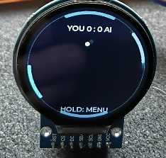
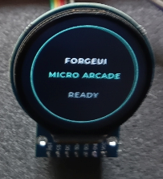

# ForgeUI MicroPong

ForgeUI MicroPong is an official ForgeUI Hardware Lab Micro Project developed by RTechAI. MicroPong is the featured game, with MicroSnake included as a playable bonus example. It is built on the ForgeUI Micro Arcade framework and the physically tested GC9A01 240×240 round display baseline.

## Project overview

MicroPong brings joystick-controlled Pong to a circular ESP32-S3 display. It demonstrates LVGL graphics, joystick input, modular game architecture, and small-screen embedded development. Micro Arcade provides the boot and launcher framework; each game owns its gameplay and rendering.

> Flash it.
> Play it.
> Open the code.
> Hack it.

**Status: PHYSICAL PASS — validated by Scott.** The selector defaults to MicroPong, followed by the MicroSnake bonus game and a MicroAsteroids placeholder.

## ForgeUI Ecosystem

ForgeUI is developed by [RTechAI](https://github.com/RTechAI).

- [ForgeUI website](https://forgeui.co.nz/): the ForgeUI platform.
- [ForgeUI Studio](https://github.com/RTechAI/esp32p4-ui-studio): the visual embedded UI/HMI development environment.
- [ForgeUI Hosted Studio](https://studio.forgeui.co.nz/): the browser-based Studio.
- [RTechAI GitHub organisation](https://github.com/RTechAI): ForgeUI repositories and examples.
- [ForgeUI Hardware Lab](#forgeui-hardware-lab): physically tested hardware foundations and Micro Projects.

## ForgeUI Hardware Lab

MicroPong builds on the [GC9A01 round-display baseline](https://github.com/RTechAI/forgeui-hw-gc9a01-240x240-round) and reuses the input and display foundation from the standalone [MicroSnake](https://github.com/RTechAI/forgeui-hw-gc9a01-240x240-round-microsnake) example. That repository remains separate and unchanged. Hardware lineage does not imply Studio target integration. Scott has physically validated this MicroPong release.

## Locked hardware

ESP32-S3 N16R8, 16 MiB flash, 8 MiB octal PSRAM, GC9A01 240×240 round SPI TFT.

| Connection | GPIO |
| --- | --- |
| Display SCLK | 10 |
| Display MOSI | 11 |
| Display DC | 12 |
| Display CS | 13 |
| Display RST | 14 |
| Joystick VRX | 4 |
| Joystick VRY | 5 |
| Joystick SW | 6 |

Use the baseline 3.3 V supply and common ground. No MISO or separate backlight GPIO. Display: SPI2, mode 0, 20 MHz, RGB565 with LVGL byte swap; existing inversion and mirroring retained. Input: ADC1 channels 3/4, 12-bit, 12 dB attenuation, active-low switch with 30 ms debounce. The hardware input files and panel driver are copied unchanged.

Flash remains DIO at 80 MHz. PSRAM remains auto-detected octal at 80 MHz, memory-mapped without malloc integration. The baseline disables the boot PSRAM memory test to avoid the early watchdog timeout. DMA draw buffers, LVGL tick, and handler task are unchanged; display initialization now accepts an application startup callback.

## Boot and controls

The LVGL-only boot shows FORGEUI / MICRO ARCADE / READY on a dark background, with a lightweight cyan ring fade. After 1.6 seconds the selector opens.

- Joystick UP/DOWN: select an entry; return to center between moves.
- Button: launch the selected game. MicroAsteroids displays COMING SOON.
- Hold button for one second in gameplay: return to the selector. Release the launch button first.

The round-display selector lists MicroPong first, MicroSnake second, and MicroAsteroids as a coming-soon placeholder. MicroPong is selected by default.

## MicroPong gameplay

The full circular court uses curved paddles around the perimeter, a bright ball, a dark background, and cyan/teal accents. All visuals are LVGL primitives; paddle and ball movement supply the animation. There is no inset square court.

- You control the cyan left paddle with joystick UP/DOWN. Deflection controls paddle speed; the center deadzone holds position.
- The AI controls the blue right paddle with limited speed and a tracking deadzone.
- The top/bottom sectors reflect the ball. Missing a paddle in either side sector awards the opponent a point.
- Paddle contact aims the ball inward with an offset based on the contact position. Ball speed rises with rallies, up to a fixed cap.
- Each point has a 900 ms READY serve delay. First to seven wins; the game freezes with YOU WIN or AI WINS.
- A short button press/release resets the match at any time. Holding for one second returns to the selector.

The game owns its ball physics, paddle movement, AI, scoring, serve and game-over states, rendering, and restart behavior in main/games/micropong/. Physics uses 5 ms steps with bounded catch-up after a stall, avoiding large collision jumps. LVGL objects are reused during play. No additional task or timer is created.

## MicroSnake bonus game

MicroSnake is included as a bonus game example. Steer with both joystick axes, collect pink food for 10 points, and avoid the snake's body. The snake wraps to the opposite playable edge of its circular row or column. Press the button after game over to restart, or hold it for one second to return to the launcher.

The game uses a full-screen LVGL layer with a circular arena, edge-safe score/status areas, and a subtle perimeter ring. Food appears only in playable unoccupied cells; snake length is capped at 72 segments.

## Physical validation

Scott confirmed physical PASS for this release:

| Area | Result |
| --- | --- |
| ForgeUI Micro Arcade boot | PASS |
| Game selector | PASS |
| MicroPong featured gameplay | PASS |
| MicroSnake bonus game | PASS |

The firmware build and flash to the ESP32-S3 on COM10 also passed. This documentation checkpoint does not change firmware or require another build/flash cycle.

### Hardware evidence

MicroPong running on the GC9A01 round display:

ForgeUI Micro Arcade boot:

[Earlier Micro Arcade selector photograph](docs/images/forgeui-micro-archade-gc9a01-round-2.png) shows the framework before MicroPong became the first/default entry. The current release lists MicroPong first.

## Architecture

~~~text
main/
  main.c
  arcade/
    arcade.c
    arcade.h
    game_selector.c
    game_selector.h
  games/
    micropong/
      micropong.c
      micropong.h
    microsnake/
      microsnake.c
      microsnake.h
  input/
    micro_input.c
    micro_input.h
  display/
    display.c
    display.h
    gc9a01.c
    gc9a01.h
~~~

The launcher owns boot, selection, launch, and return-to-menu lifecycle. It polls input once every 10 ms on the LVGL task and passes the sample to the active game. Each game owns its gameplay, rendering, state, and rules. No game logic lives in the launcher or selector.

To add a future module, implement start/tick/stop callbacks, add its source to main/CMakeLists.txt, and register its name and callbacks in arcade.c. The selector consumes the registry without game-specific changes. A NULL start marks a placeholder. Stop must release any module-owned resources and cancel private timers; the host then cleans screen children. Both games have no private timer or heap allocations beyond LVGL objects. All UI operations run on the existing LVGL task, with startup performed before that task starts.

This project adds no sound, speakers, extra hardware, DOOM, or networking. It uses no external image assets.

## Build and flash

Use the baseline ESP-IDF 5.5.4 installation. Target is set to esp32s3 in CMakeLists.txt. Tracked sdkconfig.defaults supplies the board defaults; ESP-IDF generates the local sdkconfig. Use a dedicated build directory as shown below. Dependencies are LVGL ~8.3.0 and espressif/esp_lcd_gc9a01 ^1.0; the baseline resolves to 8.3.11 and 1.2.0.

~~~powershell
idf.py -B build-micropong -p COMx build flash
~~~

Run from an ESP-IDF-enabled terminal in the repository root. Replace COMx with the connected board's serial port (COM10 for the validated build). Keep build output, managed dependencies, generated configuration, caches, and local .vscode/settings.json changes out of release commits.

## Attribution

ForgeUI MicroPong is developed by RTechAI and built on the ForgeUI Micro Arcade framework. The GC9A01 foundation originated from [UsefulElectronics/esp32s3-gc9a01-lvgl](https://github.com/UsefulElectronics/esp32s3-gc9a01-lvgl). Original Useful Electronics / Ward Almasarani notices are retained. ESP-IDF, LVGL, and the managed GC9A01 component retain their respective licences and notices.
