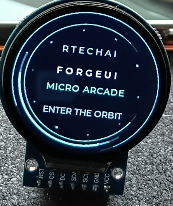
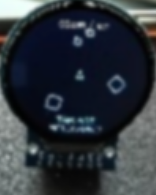

# ForgeUI MicroAsteroids — ESP32-S3 + GC9A01 240×240 Round

ForgeUI MicroAsteroids is an official ForgeUI Hardware Lab Micro Project developed by RTechAI. It is an Asteroids-style embedded arcade game built on the ForgeUI Micro Arcade framework and the physically tested GC9A01 240×240 round display baseline.

## Project overview

MicroAsteroids is the featured game, with MicroSnake included as a playable bonus example. ForgeUI Micro Arcade is the launcher framework: it provides the animated boot, game selector and shared game lifecycle. Each game lives in a separate module on the full circular display.

Ship outlines, spinning asteroid fragments, starfields and impact sparks use LVGL primitives only. The firmware requires no external image assets.

**Status: PHYSICAL PASS — validated by Scott.** Boot, game selector, MicroAsteroids gameplay and the MicroSnake bonus example have passed physical validation.

## ForgeUI Ecosystem

ForgeUI is developed by [RTechAI](https://github.com/RTechAI).

- [ForgeUI website](https://forgeui.co.nz/)
- [ForgeUI Studio](https://github.com/RTechAI/esp32p4-ui-studio)
- [ForgeUI Hosted Studio](https://studio.forgeui.co.nz/)
- [RTechAI GitHub organisation](https://github.com/RTechAI)
- [ForgeUI Hardware Lab](#forgeui-hardware-lab)

## ForgeUI Hardware Lab

This project uses the physically tested [GC9A01 round-display platform](https://github.com/RTechAI/forgeui-hw-gc9a01-240x240-round) and the shared input/display foundation from [MicroSnake](https://github.com/RTechAI/forgeui-hw-gc9a01-240x240-round-microsnake). These are ForgeUI Hardware Lab foundations and Micro Projects; hardware lineage does not imply Studio target integration.

## Hardware reference

**ESP32-S3 N16R8:** 16 MiB Flash, 8 MiB PSRAM.

**GC9A01:** 240×240 round TFT.

| Connection | GPIO |
| --- | --- |
| Display SCLK | 10 |
| Display MOSI | 11 |
| Display DC | 12 |
| Display CS | 13 |
| Display RST | 14 |
| Joystick VRX | 4 |
| Joystick VRY | 5 |
| Joystick SW | 6 |

Use the baseline 3.3 V supply and common ground. No MISO or separate backlight GPIO. Display remains SPI2, mode 0, 20 MHz, RGB565 with LVGL byte swap and existing inversion/mirroring. Joystick input remains ADC1 channels 3/4, 12-bit, 12 dB attenuation, active-low switch and 30 ms debounce.

Flash remains DIO at 80 MHz. PSRAM remains auto-detected octal at 80 MHz, memory-mapped without malloc integration. The baseline boot PSRAM memory test remains disabled to avoid the early watchdog timeout. Display driver, LVGL transport, DMA buffers, LVGL tick/handler task, input driver and board configuration are unchanged.

## Boot and game selector

The 2.4-second FORGEUI / MICRO ARCADE ident fills the circular display with three animated arc sweeps, teal/cyan colour transitions and subtly orbiting stars. LVGL removes the boot animations when the selector opens.

The selector shows FORGEUI MICRO GAMES with:

- **> MicroAsteroids** — featured and selected by default.
- **MicroSnake** — playable bonus example.
- **Coming Soon** — reserved for a future module.

Move up/down, returning to centre between selections. Press to launch. Hold the button for one second during either game to return to the selector; release the launch press first.

## MicroAsteroids gameplay

- **Left/right:** rotate; deflection controls rotation speed.
- **Up:** forward thrust. **Down:** reverse thrust. Release to coast with gentle drag.
- **Tap:** fire on press. Release between shots. A one-second hold returns to the menu.
- Large asteroids score **20 points**, splitting into two fragments worth **50 points each**.
- Clear the field to advance waves. Asteroid count and speed increase to fixed caps.
- Ship and asteroids wrap across the circular bezel to the opposite edge. There is no square game window.
- A blinking **1.5-second shield** protects the ship at launch and each new wave.
- Collision ends the run. Game over shows score and session best. **Tap and release to retry**, or hold for the menu. Best score lasts until reboot.

The separate module owns movement, rotation, firing, collisions, scoring, waves, game over and restart. Fixed pools hold 12 asteroids, 8 shots and 16 sparks. Simulation uses 10 ms steps with catch-up capped at 50 ms; redraw requests are limited to about 30 per second. Actual frame rate depends on the existing display transport. No private game task/timer or per-frame LVGL object allocation is added.

## MicroSnake bonus example

The existing module is preserved unchanged. Steer with both joystick axes, collect pink food for 10 points, and avoid the snake's body. The snake wraps across its circular row or column. Press after game over to restart, or hold for one second for the selector. The arena retains its edge-safe HUD, perimeter ring and 72-segment cap.

## Micro Arcade framework and architecture

```text
main/
  main.c
  arcade/
    arcade.c / arcade.h                 lifecycle and shared input sample
    boot.c / boot.h                     animated console ident
    game_selector.c / game_selector.h   registry-based selector
  games/
    microasteroids/                     standalone featured game
    microsnake/                         preserved bonus example
  input/
    micro_input.c / micro_input.h       shared joystick input
  display/
    display.c / display.h               unchanged LVGL transport
    gc9a01.c / gc9a01.h                 unchanged panel driver
```

The launcher polls input once every 10 ms on the LVGL task and passes the sample to the active game. Each module implements start/tick/stop. Game logic stays in each module. Stop releases module-owned resources; the host deletes screen children. All UI operations run on the existing LVGL task, with startup performed before the task begins.

To add a game, register its callbacks in `arcade.c` and add its source to `main/CMakeLists.txt`. A NULL start marks a coming-soon entry.

## Build and flash

Use the baseline ESP-IDF 5.5.4 in an ESP-IDF-enabled terminal. CMake sets the target to `esp32s3`. Tracked `sdkconfig.defaults` supplies board defaults. Dependencies remain LVGL ~8.3.0 and espressif/esp_lcd_gc9a01 ^1.0; the local baseline resolves to 8.3.11 and 1.2.0.

```powershell
idf.py -B build-microasteroids -p COM10 build flash
```

Replace COM10 if the connected board uses another port. Keep `.vscode/settings.json`, build output, generated files and caches out of commits.

## Physical validation

Scott confirmed physical PASS for this release:

| Area | Result |
| --- | --- |
| ForgeUI Micro Arcade boot | PASS |
| Game selector | PASS |
| MicroAsteroids featured gameplay | PASS |
| MicroSnake bonus example | PASS |

The ESP-IDF 5.5.4 firmware build and flash to the ESP32-S3 on COM10 passed, with flash data hashes verified. This final documentation checkpoint changes no firmware and does not require another build/flash cycle.

### Hardware photographs

ForgeUI Micro Arcade boot on the GC9A01 round display:



[Additional boot photograph](docs/images/forgeui-micro-games-microasteroids3.png)

Game selector with MicroAsteroids featured and MicroSnake available:


MicroAsteroids running on the circular display:



## Attribution

ForgeUI MicroAsteroids is developed by RTechAI and built on the ForgeUI Micro Arcade framework. The GC9A01 foundation originated from [UsefulElectronics/esp32s3-gc9a01-lvgl](https://github.com/UsefulElectronics/esp32s3-gc9a01-lvgl). Original Useful Electronics / Ward Almasarani notices are retained. ESP-IDF, LVGL, and the managed GC9A01 component retain their respective licences and notices.
