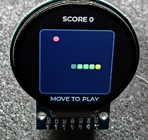

# ForgeUI MicroSnake — ESP32-S3 + GC9A01 240×240 Round

ForgeUI MicroSnake is an official ForgeUI Hardware Lab Micro Project developed by RTechAI. It is a joystick-controlled embedded game built on the physically tested ESP32-S3 + GC9A01 240×240 round display baseline.

**Project status:** MicroSnake v0.1 — PHYSICAL PASS. It provides joystick-controlled snake movement, food, scoring, self-collision, and button restart.

## ForgeUI Ecosystem

ForgeUI is developed by [RTechAI](https://github.com/RTechAI). The [ForgeUI website](https://forgeui.co.nz/) introduces the platform, while [ForgeUI Studio](https://github.com/RTechAI/esp32p4-ui-studio) is the public visual embedded UI/HMI development environment for supported ESP32 hardware.

[ForgeUI Hosted Studio](https://studio.forgeui.co.nz/) is the browser-based ForgeUI Studio application for visual design, native LVGL C generation, browser preview, and supported ESP-IDF build-and-flash workflows. The [RTechAI GitHub organisation](https://github.com/RTechAI) hosts ForgeUI public repositories, hardware references, framework baselines, examples, and related development work.

[ForgeUI Hardware Lab](#forgeui-hardware-lab) is the physically tested hardware and project collection within the ForgeUI ecosystem. MicroSnake is its first official ForgeUI Micro Project.

```text
RTechAI
└── ForgeUI
    └── ForgeUI Hardware Lab
        └── Micro Projects
            └── MicroSnake
```

## Micro Project Overview

MicroSnake brings embedded game development to a small round display. Its joystick-controlled Snake game provides a practical way to explore ESP32-S3 graphics, LVGL rendering, input handling, and reusable Micro Project architecture.

The project is intended for learning, experimentation, and hacking. Future expansion can introduce gameplay modes, animation, scoring, and other small-screen experiments on the proven hardware foundation.

The Micro Project concept:

> Flash it.<br>
> Play it.<br>
> Open the code.<br>
> Hack it.

Flashing starts MicroSnake with a short ForgeUI/MicroSnake startup screen, then enters the game.

## Hardware Foundation

MicroSnake builds on the physically tested [ForgeUI GC9A01 round-display baseline](https://github.com/RTechAI/forgeui-hw-gc9a01-240x240-round).

- ESP32-S3 DevKitC-1 N16R8
- Flash: 16 MiB
- PSRAM: 8 MiB
- Display: GC9A01 1.28-inch 240×240 round SPI TFT
- No MISO connection and no separate backlight pin

The baseline validated firmware build and flash, GC9A01 initialization and SPI rendering, LVGL startup, the ForgeUI ALIVE showcase, and GPIO10–GPIO14 flat-ribbon wiring. MicroSnake v0.1 builds on that known-good platform and has passed physical gameplay validation.

## Display Wiring

| GC9A01 | ESP32-S3 |
| --- | --- |
| VCC | 3.3V |
| GND | GND |
| SCL / SCLK | GPIO10 |
| SDA / MOSI | GPIO11 |
| DC | GPIO12 |
| CS | GPIO13 |
| RST | GPIO14 |
| MISO | Unused |

GPIO10–GPIO14 are the physically proven flat-ribbon display connection. Do not change them.

## Joystick Input Standard

Connect a typical analog joystick module with power disconnected:

| Joystick | ESP32-S3 | Purpose |
| --- | --- | --- |
| VCC | 3.3V | Use 3.3 V, not 5 V, to keep outputs within GPIO voltage limits. |
| GND | GND | Common ground |
| VRX | GPIO4 | ADC1 channel 3 |
| VRY | GPIO5 | ADC1 channel 4 |
| SW | GPIO6 | Active-low button with internal pull-up |

GPIO4/5/6 are exposed on the [Espressif DevKitC-1 header](https://docs.espressif.com/projects/esp-dev-kits/en/latest/esp32s3/esp32-s3-devkitc-1/user_guide_v1.1.html). They avoid the locked display pins GPIO10–14, flash/PSRAM pins GPIO26–37, USB pins GPIO19/20, and strapping pins GPIO0/3/45/46 listed in the [ESP32-S3 hardware guidance](https://docs.espressif.com/projects/esp-hardware-design-guidelines/en/latest/esp32s3/schematic-checklist.html).

`main/input/micro_input.h` exposes `micro_input_init()` and `micro_input_read()` for future Micro Projects. It has no LVGL or game dependency. A single caller polls about every 10 ms, receiving raw 12-bit X/Y counts, axis validity, and a button state debounced for 30 ms. ADC read errors invalidate the axes while button sampling continues.

The input layer polls in the existing LVGL task. ADC1 uses 12 dB attenuation; readings are uncalibrated counts from 0–4095, not voltage. MicroSnake v0.1 uses a centre deadzone and selects the stronger axis for each turn.

The joystick input layer and MicroSnake v0.1 gameplay passed physical validation: both axes steer the snake, SW restarts the game after a self-collision, and the GC9A01 display remains stable.

## MicroSnake v0.1 Gameplay

MicroSnake renders a 12×12 playfield inside the round display's safe area using LVGL primitives. Move the joystick to turn; the snake wraps at the playfield edges. Collect food to grow and add 10 points. A collision with the snake body ends the game. Press the joystick switch (SW) to restart after game over.

`main/game/microsnake.c` contains game state, movement, collision, food placement, score handling, and LVGL game rendering. It consumes `main/input/micro_input.h` and contains no GPIO access. The retained `main/input/` layer remains the hardware boundary for future ForgeUI Micro Projects.

## Physical Gameplay Evidence



## Software Stack

- ESP-IDF 5.5.4
- LVGL 8.3.11
- `espressif/esp_lcd_gc9a01` 1.2.0
- SPI2, mode 0, 20 MHz, RGB565 with `CONFIG_LV_COLOR_16_SWAP=y`
- 16 MiB DIO flash at 80 MHz
- 8 MiB auto-detected octal PSRAM at 80 MHz DDR
- `CONFIG_SPIRAM_USE_MEMMAP=y`: PSRAM is initialized and mapped, without malloc-heap integration

The firmware now uses an LVGL-only MicroSnake v0.1 game screen without external assets. The GC9A01 driver, LVGL runtime/configuration, ESP-IDF configuration, flash configuration, and PSRAM configuration are retained from the hardware foundation. The main component source list adds the game module; ADC support uses the ESP-IDF component already included by the main component.

## Build and Flash

Use ESP-IDF 5.5.4 with the board connected:

```powershell
idf.py build
idf.py -p COMx flash
idf.py -p COMx monitor
```

Replace `COMx` with the detected port. Use `Ctrl-]` to exit the monitor. These commands run MicroSnake v0.1.

## Related ForgeUI Projects

- [GC9A01 Round Display Baseline](https://github.com/RTechAI/forgeui-hw-gc9a01-240x240-round) — MicroSnake's physically tested hardware foundation.
- [ForgeUI-P4](https://github.com/RTechAI/ForgeUI-P4) — ESP32-P4 LVGL hardware baseline and framework.
- [esp32p4-ui-studio](https://github.com/RTechAI/esp32p4-ui-studio) — public local ForgeUI Studio reference for ESP32-P4 and LVGL 9.
- [ForgeUI-One](https://github.com/RTechAI/ForgeUI-One) — ESP32-P4 LVGL starter baseline and embedded UI framework.

## ForgeUI Hardware Lab

ForgeUI Hardware Lab is an RTechAI collection of physically tested ESP32 boards, displays, peripherals, examples, and experimental projects. Each project documents hardware identity, wiring configuration, software baseline, reproducible build process, and physical validation evidence.

Micro Projects build focused applications on these proven foundations. MicroSnake is an official ForgeUI Hardware Lab Micro Project developed by RTechAI. Its hardware lineage does not imply current ForgeUI Studio target integration.

## About ForgeUI

ForgeUI is developed by RTechAI. ForgeUI Studio is a visual embedded UI/HMI development environment for supported ESP32 hardware, while ForgeUI Hardware Lab provides the physically tested hardware foundations and focused Micro Projects that support hands-on development.

## Attribution

The MicroSnake application/project identity belongs to ForgeUI/RTechAI. Its hardware foundation comes from [forgeui-hw-gc9a01-240x240-round](https://github.com/RTechAI/forgeui-hw-gc9a01-240x240-round), whose upstream history and references remain credited.

That baseline began from [UsefulElectronics/esp32s3-gc9a01-lvgl](https://github.com/UsefulElectronics/esp32s3-gc9a01-lvgl). Its unrelated application code and generated UI assets were removed from the active baseline. Original Useful Electronics / Ward Almasarani attribution remains in the retained GC9A01 header.

ESP-IDF, LVGL, and the managed `espressif/esp_lcd_gc9a01` driver component remain subject to their own licences and notices. Their attribution and retained source notices are preserved.
