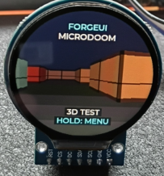
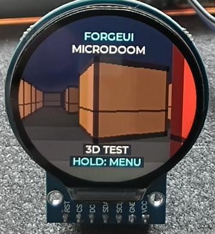
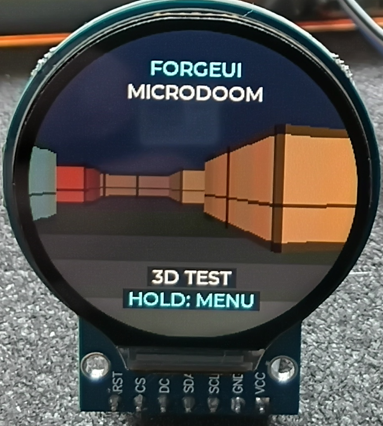

# ForgeUI MicroDOOM — ESP32-S3 + GC9A01 240×240 Round

ForgeUI MicroDOOM is an experimental ForgeUI Hardware Lab Micro Project developed by RTechAI. It explores Doom-style first-person rendering and embedded 3D graphics on the ESP32-S3 + GC9A01 240×240 round display platform.

**Status: milestone 0.1 — PHYSICAL PASS, validated by Scott.** This is a Doom-style renderer proof using lightweight raycasting, not a complete Doom port. The default MicroDOOM selector entry opens a first-person test corridor. There are no WAD files, monsters, weapons, sound, networking or external rendering assets.

## Project overview

MicroDOOM 0.1 demonstrates a first-person scene on small ESP32 hardware with perspective walls, camera rotation and joystick-controlled movement. The scene fills the usable circular display, with procedural wall detail and animated illumination. This milestone establishes the embedded graphics foundation for future experiments.

## Project context

MicroDOOM follows MicroSnake, MicroPong and MicroAsteroids as part of the ForgeUI Micro Games family. It explores the limits of embedded graphics on small ESP32 hardware, using the ForgeUI Micro Arcade framework as its foundation.

Scott confirmed the boot, 3D test scene, joystick movement and smooth renderer performance on the physical device. Smoothness is a qualitative observation; no measured FPS benchmark is claimed.

## ForgeUI Ecosystem

ForgeUI is developed by [RTechAI](https://github.com/RTechAI).

- [ForgeUI website](https://forgeui.co.nz/)
- [ForgeUI Studio](https://github.com/RTechAI/esp32p4-ui-studio)
- [ForgeUI Hosted Studio](https://studio.forgeui.co.nz/)
- [RTechAI GitHub organisation](https://github.com/RTechAI)
- [ForgeUI Hardware Lab](#forgeui-hardware-lab)

## ForgeUI Hardware Lab

This project uses the physically tested [GC9A01 round-display platform](https://github.com/RTechAI/forgeui-hw-gc9a01-240x240-round) and its shared input/display foundation. MicroDOOM 0.1 has also been physically validated on this platform. Hardware lineage does not imply Studio target integration.

## Hardware reference

**ESP32-S3 N16R8:** 16 MiB Flash, 8 MiB PSRAM.

**GC9A01:** 240×240 round TFT.

| Connection | GPIO |
| --- | --- |
| Display SCLK | 10 |
| Display MOSI | 11 |
| Display DC | 12 |
| Display CS | 13 |
| Display RST | 14 |
| Joystick VRX | 4 |
| Joystick VRY | 5 |
| Joystick SW | 6 |

Use the baseline 3.3 V supply and common ground. No MISO or separate backlight GPIO. Display remains SPI2, mode 0, 20 MHz, RGB565 with LVGL byte swap and existing inversion/mirroring. Joystick input remains ADC1 channels 3/4, 12-bit, 12 dB attenuation, active-low switch and 30 ms debounce.

Flash remains DIO at 80 MHz. PSRAM remains auto-detected octal at 80 MHz, memory-mapped without malloc integration. The baseline boot PSRAM memory test remains disabled to avoid the early watchdog timeout. Display driver, LVGL transport, DMA buffers, LVGL tick/handler task, input driver and board configuration are unchanged.

## Boot and game selector

The preserved ForgeUI Micro Arcade boot experience displays the 2.4-second FORGEUI / MICRO ARCADE ident with animated arc sweeps, teal/cyan colour transitions and orbiting stars. LVGL removes the boot animations when the selector opens.

The registry-based FORGEUI MICRO GAMES selector and shared joystick navigation remain in place. MicroDOOM is selected by default, with MicroSnake and a coming-soon slot retained. Move up/down, returning to centre between selections, and press to launch. Hold the button for one second during a running module to return to the selector; release the launch press first.

## MicroDOOM 0.1 graphics proof

The FORGEUI / MICRODOOM / 3D TEST overlay sits over a full-display first-person scene. The renderer covers all 240×240 pixels, using the physical circular bezel as its mask. Rust, muted green and dark red wall panels have distance shading, directional shading, perspective trim and gently pulsing illumination.

- **Joystick up/down:** move forward/backward.
- **Joystick left/right:** rotate the camera.
- **Hold the switch for one second:** return to the selector.

Movement is proportional outside the shared input thresholds. Wall collision includes a camera radius and allows sliding along walls. Invalid ADC samples stop movement. There is no automatic camera movement; the lighting animates while stationary.

The engine casts 120 bounded grid rays and draws two-pixel wall columns through LVGL's existing draw context. Cached column geometry is reused for each display strip. It requests at most 20 scene frames per second; this is a scheduling limit, not a measured frame rate. No full-screen framebuffer, PSRAM allocation, private task, timer or per-frame LVGL object creation is added.

## Micro Arcade framework and architecture

```text
main/
  main.c
  arcade/
    arcade.c / arcade.h                 lifecycle and shared input sample
    boot.c / boot.h                     animated console ident
    game_selector.c / game_selector.h   registry-based selector
  engine/
    microdoom.c / microdoom.h           camera, collision controls and lifecycle
    renderer.c / renderer.h             procedural map, raycasting and drawing
  games/                               inherited example modules
  input/
    micro_input.c / micro_input.h       shared joystick input
  display/
    display.c / display.h               LVGL transport
    gc9a01.c / gc9a01.h                 panel driver
```

The launcher polls input once every 10 ms on the LVGL task and passes the sample to the active module. Each module implements start/tick/stop. Stop releases module-owned resources; the host deletes screen children. All UI operations run on the existing LVGL task, with startup performed before the task begins.

Module callbacks are registered in `main/arcade/arcade.c`, with sources listed in `main/CMakeLists.txt`. A NULL start marks a coming-soon entry. Rendering and MicroDOOM logic live in `main/engine`; the launcher only manages lifecycle and shared input. The boot, input driver, display integration and board configuration are preserved.

## Build and flash

Use the baseline ESP-IDF 5.5.4 in an ESP-IDF-enabled terminal. CMake sets the target to `esp32s3`. Tracked `sdkconfig.defaults` supplies board defaults. Dependencies remain LVGL ~8.3.0 and espressif/esp_lcd_gc9a01 ^1.0.

To build and flash the graphics proof:

```powershell
idf.py -B build-microdoom -p COM10 build flash
```

Replace COM10 if the connected board uses another port. Keep `.vscode/settings.json`, build output, generated files and caches out of commits.

The milestone passed its ESP-IDF 5.5.4 build and flash to COM10, with flash data hashes verified. This documentation checkpoint preserves that tested firmware and requires no additional build or flash.

## Physical validation

Scott confirmed **PHYSICAL PASS** for the renderer proof:

| Area | Result |
| --- | --- |
| ForgeUI MicroDOOM boot | PASS |
| 3D test scene | PASS |
| Joystick movement | PASS |
| Smooth renderer performance | PASS — qualitative observation |

These results validate milestone 0.1 as an experimental graphics proof. They do not establish a full Doom engine implementation or a measured frame-rate guarantee.

### Physical validation images

MicroDOOM 3D renderer proof on the GC9A01 round display:



Another first-person corridor view from the movement validation session:



Hardware validation photograph showing the running renderer and display module:



## Limitations

- The scene uses a fixed grid map and vertical raycast walls, with a fixed camera height and no vertical look.
- Wall detail is procedural; floor and ceiling use simple colour fills rather than textured geometry.
- The 20-frame-per-second request cap is not a measured display frame rate. Rendering shares the existing LVGL task and SPI transport.
- There are no enemies, weapons, WAD loading, sound, networking or additional gameplay systems.

## Future possibilities

Future graphics experiments could explore richer procedural surfaces, lighting variations, additional test layouts and measured rendering performance. These are possibilities, not implemented features or a commitment to a complete Doom port.

## Attribution

ForgeUI MicroDOOM is developed by RTechAI and built on the ForgeUI Micro Arcade framework. The GC9A01 foundation originated from [UsefulElectronics/esp32s3-gc9a01-lvgl](https://github.com/UsefulElectronics/esp32s3-gc9a01-lvgl). Original Useful Electronics / Ward Almasarani notices are retained. ESP-IDF, LVGL, and the managed GC9A01 component retain their respective licences and notices.
