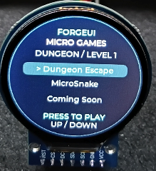
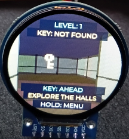
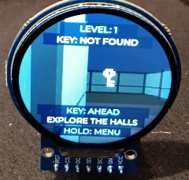
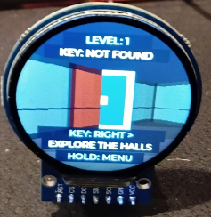
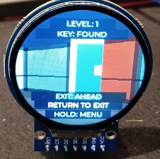

# ForgeUI Dungeon Escape

ForgeUI Dungeon Escape is an original first-person embedded adventure game built on the ForgeUI Micro Games LVGL 9.2.2 foundation.

The player explores a small dungeon, finds the key, unlocks the exit, and escapes.

## ForgeUI Ecosystem

ForgeUI Dungeon Escape is part of the wider [ForgeUI](https://forgeui.co.nz/) ecosystem: a set of tools, examples, and hardware projects for designing interactive embedded experiences.

- [ForgeUI Studio](https://github.com/RTechAI/esp32p4-ui-studio) provides the visual UI-development environment.
- [ForgeUI Hosted Studio](https://studio.forgeui.co.nz/) makes ForgeUI Studio available in the browser.
- [ForgeUI Hardware Lab](https://github.com/RTechAI) collects the tested embedded hardware projects and platform examples.
- ForgeUI Micro Games are small embedded game-development examples built on those foundations.

ForgeUI Micro Games demonstrate ESP32 hardware, LVGL embedded graphics, input systems, and interactive experiences. They provide practical ForgeUI Studio examples alongside focused, runnable firmware projects.

## Project Context

ForgeUI Dungeon Escape is an original RTechAI ForgeUI Micro Games project for ESP32-S3 game development. It is built using:

- ESP32-S3 hardware platform
- GC9A01 240×240 round display
- LVGL 9.2.2
- ESP-IDF 5.5.4

The project is a compact example of LVGL embedded graphics and embedded game development for GC9A01 round display projects in the ForgeUI Hardware Lab.

## Physical Validation

### Boot screen

ForgeUI Dungeon Escape boot screen running on an ESP32-S3 with a GC9A01 round display.

### Level 1 gameplay

Level 1 dungeon exploration on the GC9A01 240×240 round TFT.

### Key found state

The key objective displayed during the Level 1 exploration sequence.

### Door and exit state

The locked exit door encountered during the dungeon escape objective.

### Hardware setup

ForgeUI Dungeon Escape running on ESP32-S3 with GC9A01 round display hardware.

## Technical details

- **Hardware:** ESP32-S3 N16R8
- **Display:** GC9A01 240×240 round TFT
- **Runtime:** LVGL 9.2.2
- **ESP-IDF:** 5.5.4
- **Input:** Analogue joystick GPIO4/GPIO5; button GPIO6

## Features

- First-person raycasting renderer
- Joystick movement
- Collision detection
- Dungeon exploration
- Key collection
- Locked exit
- Escape sequence
- Replay

## Attribution

ForgeUI Dungeon Escape is an original RTechAI ForgeUI Micro Games project.

Third-party components and frameworks:

- [LVGL](https://lvgl.io/)
- [ESP-IDF](https://github.com/espressif/esp-idf)
- [GC9A01 component](https://components.espressif.com/components/atanisoft/esp_lcd_gc9a01)

## Licence

ForgeUI Dungeon Escape is released under the ForgeUI Micro Games Attribution Licence.

This project is intended as an educational embedded development example.

Credit:

ForgeUI Dungeon Escape\
RTechAI / ForgeUI
